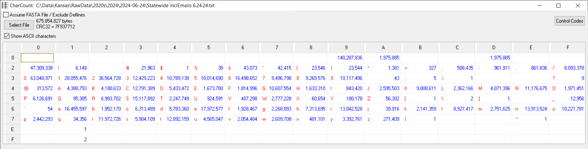

---
output:
  html_document:
    code_download: true
    theme: cerulean           
    toc: yes
    toc_depth:  3
    toc_float:
      collapsed:  yes
      smooth_scroll: yes
    number_sections: yes
    code_folding:  show
    
params:
  ELECTION_DATE:      "2024-08-06"
  FILE_DATE:          "2024-06-24"       
  RAW_DATA_FILE:      "Statewide inclEmails 6.24.24.txt"
  FIXED_DATA_FILE:    "Statewide-Fixed.txt"
  UPDATED_DATA_FILE:  "Statewide-Updated.txt"    
  COUNTS_DIR:         "Counts"  
  
title:  "Kansas Voter Registration File - `r params$FILE_DATE`"
author: "Earl F Glynn"
date:   "<small>`r Sys.Date()`</small>"  
---

```{r setup, echo = FALSE}
# http://biostat.mc.vanderbilt.edu/wiki/Main/KnitrHtmlTemplate
require(Hmisc)    # provides knitrSet and other functions
knitrSet(lang = 'markdown',   # If using blogdown: knitrSet(lang='blogdown')
         fig.align = 'left',
         w = 6.5,
         h = 4.5,
         cache = FALSE)
```

`r hidingTOC(buttonLabel = "Outline")`

```{r setup2, include = FALSE}
knitr::opts_chunk$set(
  echo = TRUE,
  comment    = NA)

time.1 <- Sys.time()
```
          
TO DO:  

* Mailing addresses in separate file for inspection          
* Name has to identify possible duplicate entries
                                                   
Script to perform quality checks and produce frequency counts of many fields in the Kansas voter registration file.

**History**

* Convert very old R script to markdown and tidyverse | 2019-01-26

* Programmatically "fix" one Geary County voter with extra tabs in the `text_mail_address` fields.  This has been a problem since 2006!! | 2023-03-21

**Output Files**

* `County-Voter-Election-Code-Summary.xlsx`

* `Statewide-Election-Code-Summary.xlsx`

* `Statewide-Election-Codes-by-Voter.txt`

* `Statewide-Field-Length-Summary.xlsx`

* `Statewide-Voters-Missing-District-Info.xlsx`

* `Counts-by-Precinct.xlsx`

* `Counts-by-County.xlsx`

* `Counts-State.xlsx`

* `Statewide-Fixed.txt` - fix GE County tab problem, header consistency

* `Statewide-Updated.txt` - add additional useful variables for analysis

* `Counts` folder with CSV file of frequency counts by field

# Backstage {.tabset .tabset-fade .tabset-pills}

##  {.active}

## Constants

Use 5-year census intervals (except for interval 18-19)         

```{r}
ageBreaks <- 5 * 3:17
ageBreaks[1] <- 18
```            

 [1]  18  20  25  30  35  40  45  50  55  60  65  70  75  80  85

```{r}
ageIntervals <-
  c(paste(ageBreaks[-length(ageBreaks)], ageBreaks[-1]-1, sep = "-"),
    paste0(ageBreaks[length(ageBreaks)], "+"))
ageIntervals[1] <- "18-19"
```             

 [1] "18-19" "20-24" "25-29" "30-34" "35-39" "40-44" "45-49" "50-54" "55-59" "60-64"
[11] "65-69" "70-74" "75-79" "80-84" "85+"   


## Packages                             

```{r}
library(tidyverse)
library(writexl)
library(kableExtra)        
```

```{r}
library(lubridate)   # date/time functions
library(gplots)      # heatmap.2
library(scales)      # comma
```

## Helper Function

```{r Helpers}
Show <- function(data, caption="", bigMark="",
                 height = NULL, width = NULL, ...)
{
  data                                       |>
  kable("html", caption=caption,
        format.args=list(big.mark=bigMark))  |>
  kable_styling(bootstrap_options=c("striped", "bordered", "condensed"),
                position="left",
                full_width=FALSE, ...)       |>
  scroll_box(height = height, width = width) 
}
```                      

# Character Quality Check

Check for unusual characters using `CharCount` utility from [github](https://github.com/EarlGlynn/CharCount).  This shows the count of the 256 possible 8-bit bytes in the file.  Look for changes from recent files.

The `CharCount` table will confirm whether the field separator is a tab (x09) vs a comma (x2C), and identify possible problem characters 

Screen shot of running CharCount is saved to file `CharCount.png` for inclusion here.

```{r, out.width="1500px", echo=FALSE}

```

Problems can include x'E1' and x'F1'.  Failure to fix these characters can cause problems.

See use of `iconv` below.

# Raw data file    

## Parameters

```{r}
cat("Raw Data: ",       params$RAW_DATA_FILE, 
    "\nFixed File: ",   params$FIXED_DATA_FILE, 
    "\nUpdated File: ", params$UPDATED_DATA_FILE,
    "\nElection Date (for age computations): ", params$ELECTION_DATE, "\n")
```

## Fix problems in file programmatically

Since 2006 records with too many tabs are from Geary County.

Fix encoding issue, since text is not interpreted as a valid string because it contains non-ASCII characters.

```{r}
rawLines <- 
  read_lines(params$RAW_DATA_FILE)       |>
  iconv(from = "ISO-8859-1", to = "UTF-8")

length(rawLines)       
```

### Make header like rest of data records.

Add tab to end of header row; make it like other data lines with final tab. 

Maybe someday the Kansas Secretary of State's Office could fix this anomaly?

This makes the header row tab terminated, like the rest of the data.

But, there will be a blank last column that needs to be deleted.

```{r}
rawLines[1] <- paste(rawLines[1], "\t", sep="")
```

### Fix problem Geary County record

Only one left!  [Problem started in 2006!!]

See `C:\Data\Kansas\RawData\2020s\2023\2023-02-13\Geary-County-Parse-Problem.docx`

```{r}
verify1 <- grep("778 TC CO\t\t5302 ASHBY AVE\t", rawLines)
length(verify1)
```

```{r}
rawLines <- gsub("778 TC CO\t\t5302 ASHBY AVE\t",
                 "778 TC CO\t5302 ASHBY AVE",
                 rawLines)
```

### Fix Multiple Districts 

Assigning a voter to multiple State Rep districts should NEVER happen. 

State Rep District 

* "KR0124,KR0125" in Seward County in May 2024  -> "KR0125"
* "KR0054,KR0076" in Osage County  in June 2024 -> "KR0076"  (verify this)

```{r}
rawLines <- gsub("KR0054,KR0076", "KR0076", rawLines)
```

### Create `Fixed` data

```{r}
write_lines(rawLines, params$FIXED_DATA_FILE)         
```

## Delimiter Check

* With fixes above, all records should parse consistently.  Let's check.

* Without `comment.char` override, records with # characters are problems.

* Without `quote` override, records with apostrophes or quotation marks are problems.

```{r}
counts <- tibble(fieldCounts = count.fields(params$FIXED_DATA_FILE, sep="\t", comment.char="", quote="")) 
```

```{r}
freqCounts <- 
  counts                                |>
  group_by(fieldCounts)                 |>
  summarize(n = n(), .groups = "drop")  |>
  ungroup()
  
freqCounts |>
    Show(bigMark = ",")
```

All records should have the same number of fields.

## Read fixed file

```{r}
voters <- read_delim(params$FIXED_DATA_FILE, "\t", 
                     quote = "", 
                     comment = "", 
                     na = character(),  # some people might names of "NA"
                     col_types = cols(.default = "c"),
                     progress = FALSE)

dim(voters)
```

There is an extra column R created because of the tab at the end of
each line.  (Tabs are "separators" not "terminators".)

Verify final unwanted column has no info.
         
```{r}
table(voters[,ncol(voters)], useNA="ifany")   
```

Get rid of unwanted column    
         
```{r}
voters <- voters[,-ncol(voters)]
```

```{r}
glimpse(voters)
```

Verify current political parties (new ones added in 2024):  

```{r}
table(voters$desc_party, useNA = "ifany")
```

Genders

```{r}
table(voters$cde_gender, useNA = "ifany")
```

## Problem precincts 2024-05-02, 2024-06-24

For now, use "majority vote" to pick district

### DG Lawrence 42 S2 H46

```{r}
dg1 <- 
  voters |>
  filter(db_logid           == "Douglas", 
         precinct_text_name == "Lawrence 42 S2 H46")

dim(dg1)
```

```{r}
write_xlsx(dg1, "Precinct-Douglas-Lawrence-42-S2-H46.xlsx")
```

```{r}
table(dg1$district_ks)
```

```{r}
table(dg1$district_kr)
```
```{r}
select <- voters$db_logid           == "Douglas"  &  
          voters$precinct_text_name == "Lawrence 42 S2 H46"
sum(select)

voters$district_ks[which(select)] <- "KS0002"
voters$district_kr[which(select)] <- "KR0046"
```

### MG Fawn Creek  Twp CC2

```{r}
mg1 <- 
  voters |>
  filter(db_logid           == "Montgomery", 
         precinct_text_name == "Fawn Creek  Twp CC2")

dim(mg1)
```

```{r}
write_xlsx(mg1, "Precinct-Montgomery-Fawn Creek-Twp-CC2.xlsx")
```

```{r}
table(mg1$district_kr)
```

```{r}
table(mg1$district_cc)
```

```{r}
select <- voters$db_logid           == "Montgomery"  &  
          voters$precinct_text_name == "Fawn Creek  Twp CC2"
sum(select)

voters$district_kr[which(select)] <- "KR0011"
voters$district_cc[which(select)] <- "CC02"
```

## RL Manhattan Twp 3

```{r}
rla <-
  voters |>
  filter(db_logid           == "Riley", 
         precinct_text_name == "Manhattan Twp 3  ")

dim(rla)
```

```{r}
write_xlsx(rla, "Riley-Manhattan-Twp-3.xlsx")
```      

```{r}
table(rla$district_kr)
```

```{r}
select <- voters$db_logid           == "Riley"  &  
          voters$precinct_text_name == "Manhattan Twp 3  "
sum(select)

voters$district_kr[which(select)] <- "KR0067"
```

## RL Manhattan Twp 4

```{r}
rlb <-
  voters |>
  filter(db_logid           == "Riley", 
         precinct_text_name == "Manhattan Twp 4  ")

dim(rlb)
```

```{r}
write_xlsx(rlb, "Riley-Manhattan-Twp-4.xlsx")
```         

```{r}
table(rlb$district_kr)
```
   
```{r}
select <- voters$db_logid           == "Riley"  &  
          voters$precinct_text_name == "Manhattan Twp 4  "
sum(select)

voters$district_kr[which(select)] <- "KR0064"
```                                          

## RL Wildcat Twp

```{r}
rlc <-
  voters |>
  filter(db_logid           == "Riley", 
         precinct_text_name == "Wildcat Twp ")

dim(rlc)
```

```{r}
write_xlsx(rlc, "Riley-Wildcat-Twp.xlsx")
```  

```{r}
table(rlc$district_kr, useNA = "ifany")
```

```{r}
select <- voters$db_logid           == "Riley"  &  
          voters$precinct_text_name == "Wildcat Twp "
sum(select)

voters$district_kr[which(select)] <- "KR0064"
```          

# Cleanup / Fixups / Add new variables

Let's get rid of leading/trailing blanks in many fields.

'County` should NEVER have been named `db_logid`

```{r}
votersModified <-
  voters                                                                  |>
  rename(County = db_logid)                                               |>
  mutate(
          cde_registrant_status     = str_trim(cde_registrant_status) |>
                                      str_to_upper(),  # Lower case happened once
          
          # many fields have leading blanks to trim -- should probably trim all fields
          cde_name_title              = str_trim(cde_name_title),
          cde_name_suffix             = str_trim(cde_name_suffix),
          text_res_address_nbr_suffix = str_trim(text_res_address_nbr_suffix),
          registrant_text_email       = str_trim(registrant_text_email),
          cde_street_dir_prefix       = str_trim(cde_street_dir_prefix),
          cde_street_type             = str_trim(cde_street_type),
          cde_street_dir_suffix       = str_trim(cde_street_dir_suffix),
          cde_res_unit_type           = str_trim(cde_res_unit_type),
          text_res_unit_nbr           = str_trim(text_res_unit_nbr),
          text_res_zip5               = str_trim(text_res_zip5),
          text_res_zip4               = str_trim(text_res_zip4),
          text_mail_address1          = str_trim(text_mail_address1),
          text_mail_address2          = str_trim(text_mail_address2),
          text_mail_address3          = str_trim(text_mail_address3),
          text_mail_address4          = str_trim(text_mail_address4),
          text_mail_city              = str_trim(text_mail_city),
          text_mail_zip5              = str_trim(text_mail_zip5),
          text_mail_zip4              = str_trim(text_mail_zip4),
          text_res_carrier_rte        = str_trim(text_res_carrier_rte),
          text_mail_carrier_rte       = str_trim(text_mail_carrier_rte),
          text_phone_exchange         = str_trim(text_phone_exchange),
          text_phone_last_four        = str_trim(text_phone_last_four),
          
          text_election_code_1        = str_trim(text_election_code_1),
          text_election_code_2        = str_trim(text_election_code_2),
          text_election_code_3        = str_trim(text_election_code_3),
          text_election_code_4        = str_trim(text_election_code_4),
          text_election_code_5        = str_trim(text_election_code_5),
          text_election_code_6        = str_trim(text_election_code_6),
          text_election_code_7        = str_trim(text_election_code_7),
          text_election_code_8        = str_trim(text_election_code_8),
          text_election_code_9        = str_trim(text_election_code_9),
          text_election_code_10       = str_trim(text_election_code_10),
          polling_place_text_zip5     = str_trim(polling_place_text_zip5),
          polling_place_text_zip4     = str_trim(polling_place_text_zip4),
          district_jd                 = str_trim(district_jd),
          district_sd                 = str_trim(district_sd),
          
          text_res_physical_address = str_trim(text_res_physical_address),
          
          phone                     = paste(text_phone_area_code,
                                            text_phone_exchange,
                                            text_phone_last_four, sep = "-"),
          
          cde_gender                = if_else(cde_gender == "", "U", str_trim(cde_gender)), 
          cde_gender                = recode(cde_gender, 
                                             .missing = "U"),
          
          desc_party                = if_else(desc_party  == "", "Unaffiliated", str_trim(desc_party)), 
          desc_party                = recode(desc_party,                  
                                             .missing = "Unaffiliated"),
          
          Party                     = case_match(desc_party,
                                                  "Democratic"       ~ "D",
                                                  "Libertarian"      ~ "L",
                                                  "No Labels Kansas" ~ "N",   # new in 2024
                                                  "Republican"       ~ "R",
                                                  "Unaffiliated"     ~ "U",
                                                  "United Kansas"    ~ "K"    # new in 2024
                                                ),
          
          precinct_text_designation = str_trim(precinct_text_designation),
          precinct_text_name        = str_trim(precinct_text_name),  # needed for some counties
          precinct                  = paste(County, 
                                            precinct_text_name, precinct_text_designation, 
                                            sep = "|"),
          
     #     precinct_part_text_designation = str_trim(precinct_part_text_designation),
     #     precinct_part_text_name        = str_trim(precinct_part_text_name),
     #     precinctPart                   = paste(County, precinct_part_text_name,
     #                                            precinct_part_text_designation, sep = "|"),
          
          addressHousehold = paste(text_res_address_nbr,
                                   text_res_address_nbr_suffix,
                                   cde_street_dir_prefix, text_street_name, cde_street_type, 
                                   cde_res_unit_type, text_res_unit_nbr, 
                                   text_res_city,
                                   text_res_zip5,
                                   sep = "|"),
          nameHousehold    = paste(text_name_last, addressHousehold, sep = "|"),
          
          RegisterDate     = mdy(date_of_registration),
          RegisterYear     = lubridate::year(RegisterDate),       # Use for cleanup
          RegisterMonth    = lubridate::month(RegisterDate),
          Registered       = (RegisterDate %--% lubridate::ymd(params$ELECTION_DATE)) / years(1),
          
          BirthDate        = mdy(date_of_birth),
          BirthYear        = lubridate::year(BirthDate),          # Use for cleanup
          BirthMonth       = lubridate::month(BirthDate),
          Age              = round((BirthDate %--% lubridate::ymd(params$ELECTION_DATE)) / years(1)),
          AgeInterval      = cut(Age,
                                 breaks = c(ageBreaks, Inf),
                                 right = FALSE,
                                 labels = ageIntervals),    
          AgeRegistered    = round( as.numeric( mdy(date_of_registration)  - 
                                                mdy(date_of_birth) ) / 365.25, 2)
        )

nrow(votersModified)
write_tsv(votersModified, params$UPDATED_DATA_FILE)
```

**June 2024 data problem**

Fix Osage county voters not assigned to a congressional district -> 2nd District   #####

Related to voters assigned to two State Rep districts.

```{r}
table(votersModified$district_cg, useNA = "ifany")
```

```{r}
select <- (votersModified$County      == "Osage" &  
           votersModified$district_cg == " ")       |>
          which()

length(select)
```

Osage County is in CG0002

```{r}
votersModified$district_cg[select] <- "CG0002"
```

```{r}
table(votersModified$district_cg)
```

# Stats for State

## Status

```{r}
table(votersModified$cde_registrant_status, useNA = "ifany")
```

## Party

```{r}
table(votersModified$desc_party, useNA = "ifany")
```

```{r}
table(votersModified$Party, useNA = "ifany")
```
## Gender

```{r}
table(votersModified$cde_gender, useNA = "ifany")
```

## Age

```{r}
fivenum(votersModified$Age)
```

```{r}
table(votersModified$Age, useNA = "ifany")
```

```{r}
table(votersModified$AgeInterval, useNA = "ifany")
```

```{r}
countsState <- 
  votersModified  |>
  summarize(
             n             = n(),
             Voters        = n_distinct(text_registrant_id),
             
             nCounty       = n_distinct(County),    # verify none are missing
             nCommissioner = n_distinct(district_cc), 
             
             nCongress      = n_distinct(district_cg),
             nKSSenate      = n_distinct(district_ks),
             nKSHouse       = n_distinct(district_kr),
             nKSStateBoard  = n_distinct(district_sb),
             nKSSchoolBoard = n_distinct(district_sd),
             
             City           = n_distinct(text_res_city),
             Precinct       = n_distinct(precinct),
        #     PrecinctPart   = n_distinct(precinctPart),
             
             Email          = n_distinct(registrant_text_email),
             Phone          = n_distinct(phone),
             AddressHousehold = n_distinct(addressHousehold),
             NameHousehold    = n_distinct(nameHousehold),

             Female         = sum(cde_gender == "F", na.rm = TRUE),
             Male           = sum(cde_gender == "M", na.rm = TRUE),
             Unknown        = sum(cde_gender == "U", na.rm = TRUE),

             Democratic     = sum(desc_party == "Democratic",       na.rm = TRUE),
             Republican     = sum(desc_party == "Republican",       na.rm = TRUE),
             Libertarian    = sum(desc_party == "Libertarian",      na.rm = TRUE),
             NoLabels       = sum(desc_party == "No Labels Kansas", na.rm = TRUE),
             UnitedKansas   = sum(desc_party == "United Kansas",    na.rm = TRUE),
             Unaffilated    = sum(desc_party == "Unaffiliated"    , na.rm = TRUE),
             
             Active           = sum(cde_registrant_status == "A"),
             Inactive         = sum(cde_registrant_status == "I"),
             FractionInactive = Inactive / (Active + Inactive)
           )

countsState |> Show(bigMark = ",")
write_xlsx(countsState, paste0("Counts-State-", params$FILE_DATE, ".xlsx"))
```

## Crosstabs

### `date_of_registration`:  Year by Month

```{r}
byYearMonth <- 
  votersModified                         |>
  select(RegisterYear, RegisterMonth)    |>
  group_by(RegisterYear, RegisterMonth)  |>
  count()                                |>
  arrange(RegisterYear, RegisterMonth)   |>
  collect()                              |>
  spread(RegisterMonth, n, fill = 0)     |>          
  ungroup()         

dim(byYearMonth)
```

```{r}
write_xlsx(byYearMonth, paste0("Crosstab-RegisterYear-by-RegisterMonth-", params$FILE_DATE, ".xlsx"))
```

```{r}
byYearMonth |> Show(height = "400px")
```

Graphic

```{r}
byYearMonthRegister <-
  byYearMonth |>
  select(RegisterYear, `1`:`12`)   |>
  filter(RegisterYear >= 2012,
         RegisterYear <= 2024)
```

```{r Registrations-By-Year-and-Month, fig.width = 10, fig.height = 8}    
options(scipen=999)  # suppress scientific notation in legend      

colorPalette <- colorRampPalette(c("lemonchiffon", "yellow2", "yellow1", "gold"))
lmat <- rbind( c(0, 3, 3),  # layout matrix
               c(2, 1, 1),
               c(0, 0, 4))
lwid <- c(0.5, 4, 4)        # entry fo r each column in layout matrix
lhei <- c(1, 5, 1)          # entry for each row in layout matrix
yearMonthMatrix <- as.matrix(data.frame(byYearMonthRegister, row.names=1))
heatmap.2(yearMonthMatrix,  # must be matrix
          cellnote = yearMonthMatrix,   # same data for cell labels
          main = paste0("Counts of Kansas Voter Registrations by Month (2010 - 2024)\n",
                        "For Registered Voters in ",
                         strftime(ymd(params$FILE_DATE), "%B %Y")),  
          notecol = "black",        # change font color of cell labels to black
          density.info = "none",    # turns off density plot inside color legend
          trace = "none",           # turns off trace lines inside the heat map
          dendrogram = "none",      # suppress row and column dendrograms
          Colv = NA,                # suppress reordering
          Rowv = NA,                # suppress reordering
          key.title = NA,           # suppress title
          key.xlab = NA,            # suppress key x-axis label
          cexRow  = 1.75,    
          cexCol  = 2,
          notecex = 1.4,
          col = colorPalette,
          labCol = month.abb, srtCol=0, adjCol=0.5,
          lmat = lmat, lwid = lwid, lhei = lhei
)

mtext(paste0("Source:  Kansas Secretary of State voter file, ", params$FILE_DATE), 1, 
        adj = 0.12, col = "blue", outer = TRUE, cex = 1.0, line = -2)
mtext(paste0("Based on Registration Dates of ", comma(nrow(voters)), " voters"), 1, 
        adj = 0.19, col = "blue", outer = TRUE, cex = 0.8, line = -1)
```

### `date_of_birth`:  Year by Month

```{r}
byYearMonthAge <-
  votersModified                   |>
  select(BirthYear, BirthMonth)    |>
  group_by(BirthYear, BirthMonth)  |>
  count()                          |>
  arrange(BirthYear, BirthMonth)   |>
  collect()                        |>
  spread(BirthMonth, n, fill = 0)  |>
  ungroup()

dim(byYearMonthAge)
```

```{r}
write_xlsx(byYearMonthAge, paste0("Crosstab-BirthYear-by-BirthMonth-", params$FILE_DATE, ".xlsx"))
```

```{r}
byYearMonthAge |> Show(height = "400px")
```
                                                     
# Stats by County

```{r}
countsCounty <- 
  votersModified   |>
  group_by(County) |>
  summarize(
             n                = n(),
             Voters           = n_distinct(text_registrant_id),
             
             Commissioner     = district_cc |> unique() |> sort() |> str_flatten(collapse  = " | "),
             
             Congress         = district_cg |> unique() |> sort() |> str_flatten(collapse  = " | "),
             KSSenate         = district_ks |> unique() |> sort() |> str_flatten(collapse  = " | "),
             KSHouse          = district_kr |> unique() |> sort() |> str_flatten(collapse  = " | "),
             KSStateBoard     = district_sb |> unique() |> sort() |> str_flatten(collapse  = " | "),
             KSSchoolDistrict = district_sd |> unique() |> sort() |> str_flatten(collapse  = " | "),
            
             City             = n_distinct(text_res_city),
             
             Precinct         = n_distinct(precinct),
         #    PrecinctPart     = n_distinct(precinctPart),
             
             Email            = n_distinct(registrant_text_email),
             Phone            = n_distinct(phone),
             AddressHousehold = n_distinct(addressHousehold),
             NameHousehold    = n_distinct(nameHousehold),

             Female       = sum(cde_gender == "F", na.rm = TRUE),
             Male         = sum(cde_gender == "M", na.rm = TRUE),
             Unknown      = sum(cde_gender == "U", na.rm = TRUE),

             Democratic   = sum(desc_party == "Democratic",       na.rm = TRUE),
             Republican   = sum(desc_party == "Republican",       na.rm = TRUE),
             Libertarian  = sum(desc_party == "Libertarian",      na.rm = TRUE),
             NoLabels     = sum(desc_party == "No Labels Kansas", na.rm = TRUE),
             UnitedKansas = sum(desc_party == "United Kansas",    na.rm = TRUE),        
             Unaffilated  = sum(desc_party == "Unaffiliated",     na.rm = TRUE),
             
             Active      = sum(cde_registrant_status == "A"),
             Inactive    = sum(cde_registrant_status == "I"),
             FractionInactive = Inactive / (Active + Inactive)
           )

nrow(countsCounty)
```

```{r}
countsCounty  |> 
  Show(bigMark = ",", height = "300px")
```

```{r}
write_xlsx(countsCounty, paste0("Counts-by-County-", params$FILE_DATE, ".xlsx"))
```

## Missing district info by County

Use original, unmodified `voters` data here

```{r}
missingCommissionerDistrict  <- voters$district_cg < "CC"   
missingCongressionalDistrict <- voters$district_cg < "CG"   
missingKansasRepresentative  <- voters$district_kr < "KR"   
missingKansasSenate          <- voters$district_ks < "KS"   
missingSchoolBoard           <- voters$district_sb < "SB"   

missingDistricts <- 
  missingCommissionerDistrict  |
  missingCongressionalDistrict | 
  missingKansasRepresentative  | 
  missingKansasSenate          | 
  missingSchoolBoard          
```

```{r}
table(votersModified$County[missingDistricts])                        
```

```{r}
votersMissingDistrictInfo <- voters[missingDistricts, ]
dim(votersMissingDistrictInfo)

if (nrow(votersMissingDistrictInfo) > 0)
{
  write_xlsx(votersMissingDistrictInfo, paste0("Statewide-Voters-Missing-District-Info-", params$FILE_DATE, ".xlsx"))   
}
```

## Multiple State Rep Districts [2024-05-02, 2024-06-24 problems]

Verify problem fixed

```{r}
extra <- 
  voters  |>
  filter( grepl(",", district_kr) )

nrow(extra)

if (nrow(extra) > 0)
{
  write_xlsx(extra, paste0("Assigned-Two-StateRep-Districts-", params$FILE_DATE, ".xlsx"))   
}
```

# Stats by Precinct

```{r}
countsPrecinct <- 
  votersModified   |>
  group_by(County, precinct_text_name, precinct_text_designation) |>
  summarize(
             n                = n(),
             Voters           = n_distinct(text_registrant_id),
             
             Commissioner     = district_cc |> unique() |> sort() |> str_flatten(collapse  = " | "),
             
             # Many of these counts should be 1, but some are not
             Congress         = district_cg |> unique() |> sort() |> str_flatten(collapse  = " | "),
             KSSenate         = district_ks |> unique() |> sort() |> str_flatten(collapse  = " | "),
             KSHouse          = district_kr |> unique() |> sort() |> str_flatten(collapse  = " | "),
             KSStateBoard     = district_sb |> unique() |> sort() |> str_flatten(collapse  = " | "),
             KSSchoolDistrict = district_sd |> unique() |> sort() |> str_flatten(collapse  = " | "),
            
             nCommissioner    = n_distinct(district_cc),
             City             = n_distinct(text_res_city),
             
             Precinct         = n_distinct(precinct),
           #  PrecinctPart     = n_distinct(precinctPart),
               
             Email            = n_distinct(registrant_text_email),
             Phone            = n_distinct(phone),
             
             AddressHousehold = n_distinct(addressHousehold),
             NameHousehold    = n_distinct(nameHousehold),

             Female       = sum(cde_gender == "F", na.rm = TRUE),
             Male         = sum(cde_gender == "M", na.rm = TRUE),
             Unknown      = sum(cde_gender == "U", na.rm = TRUE),

             Democratic   = sum(desc_party == "Democratic",   na.rm = TRUE),
             Republican   = sum(desc_party == "Republican",   na.rm = TRUE),
             Libertarian  = sum(desc_party == "Libertarian",  na.rm = TRUE),
             NoLabels     = sum(desc_party == "No Labels Kansas", na.rm = TRUE),
             Unaffilated  = sum(desc_party == "Unaffiliated", na.rm = TRUE),
             
             Active      = sum(cde_registrant_status == "A"),
             Inactive    = sum(cde_registrant_status == "I"),
             FractionInactive = Inactive / (Active + Inactive),
             .groups = "drop"
           )

nrow(countsPrecinct)
write_xlsx(countsPrecinct, paste0("Counts-by-Precinct-", params$FILE_DATE, ".xlsx"))
```

```{r}
countsPrecinct  |> 
  head(10)      |>
  Show(bigMark = ",", height = "300px")
```

# Field Metastats

Create COUNTS directory if it does not exist. 

Explore counts files for unexpected problems, often at top and bottom of file.

```{r}
if (! file.exists(params$COUNTS_DIR))
{
  dir.create(params$COUNTS_DIR)
}        
```

Look at each column and create descriptive stats of data    

```{r}
nFields <- length(colnames(votersModified))     

fieldSummary <- 
  tibble(Index   = 1:nFields,
         Field   = rep("", nFields),
         Min     = rep(0, nFields),   # field length stats
         Q1      = rep(0, nFields),
         Median  = rep(0, nFields),
         Mean    = rep(0, nFields),
         Q3      = rep(0, nFields), 
         Max     = rep(0, nFields),
         NAs     = rep(0, nFields),
         N       = rep(0, nFields),
         Missing = rep(0, nFields),
         NUnique = rep(0, nFields),
         NCounty = rep(0, nFields)) 
```

`tidyverse` doesn't work well (for me) in the following, so not used.

```{r}
for (i in 1 :nFields)  
{
  column <- colnames(votersModified)[i]
  field  <- pull(votersModified, i)
  
  cat(i, column, "\n")

  counts <- table(field)
  counts <-  data.frame(as.table(counts))
  colnames(counts) <- c(column,"Count")

  COUNTSfilename <- paste0(params$COUNTS_DIR, "/", 
                           sprintf("%03d",i),"-", column)
  
 
   # Excel file are easier to view, but often unusual values better found in a CSV.
   write_csv(counts,  paste0(COUNTSfilename, ".csv"))
 
  fieldSummary$N[i]       <- length(field) - fieldSummary$Missing[i]
  fieldSummary$NUnique[i] <- length(unique(field))

  if (class(field) == "character")
  {
    zeroLengthField <- (nchar(field) == 0)  # should trim char strings?
    
    # Field width stats
    fieldSummary$NCounty[i] <- length( na.omit( unique(votersModified$County[!zeroLengthField]) ))
  
    fieldSummary$Missing[i] <- sum(nchar(field) == 0, na.rm=TRUE)
    
    fieldStats <- as.vector(summary( nchar(field[!zeroLengthField]) ) )
    if (length(fieldStats) == 6)   # Make sure length with be 7
    {
      fieldStats <- c(fieldStats, 0)   # 0 NAs
    }
    
    fieldSummary$Index[i]   <- i
    fieldSummary$Field[i]   <- column
    fieldSummary$Min[i]     <- fieldStats[1]
    fieldSummary$Q1[i]      <- fieldStats[2]  
    fieldSummary$Median[i]  <- fieldStats[3]  
    fieldSummary$Mean[i]    <- fieldStats[4]  
    fieldSummary$Q3[i]      <- fieldStats[5]
    fieldSummary$Max[i]     <- fieldStats[6]
    fieldSummary$NAs[i]     <- fieldStats[7]
  }
}                                                                                               
```

```{r}
fieldSummary |>
  Show(bigMark = ",", height = "400px")
```

```{r}
write_xlsx(fieldSummary, paste0("Statewide-Field-Length-Summary-", params$FILE_DATE, ".xlsx"))
```

# Election Codes 

Will summarize these codes combined with earlier voter files separately.

Often more than one voter file is needed for complete voter history since County Clerks are not bound by deadlines for completing this information being added to ELVIS after an election.  

```{r}
electionCodes <- 
  votersModified  |>
  select(County, text_registrant_id, starts_with("text_election_code_")) |>
  mutate(across(where(is.character), ~na_if(.,"")))                      |>
  pivot_longer(cols         = starts_with("text_election_code_"),
               names_to     = "historyIndex",
               names_prefix = "index_",
               values_to    = "ElectionCode", 
               values_drop_na = TRUE)                                    |>
  mutate(historyIndex = str_replace(historyIndex, 
                                    "text_election_code", "index")       |>
                        str_trim())                                      |>
  select(-historyIndex)                 |>  # don't need this
  unique()

dim(electionCodes)
```

In March 2023 ...

Before unique:  11,141,553

After unique:   11,141,549

So (rarely) some voters have the same code repeated.

```{r}
glimpse(electionCodes)
```


```{r}
write_tsv(electionCodes, "Statewide-Election-Codes-by-Voter.txt")
```

## Summary by Election Code

```{r}
codeSummary <- 
  electionCodes           |>
  group_by(ElectionCode)  |>
  summarize(
             nVoter  = n_distinct(text_registrant_id),
             nCounty = n_distinct(County),
           )         |>

  arrange(-nVoter, ElectionCode)

dim(codeSummary)
```

```{r}
codeSummary |> Show(bigMark = ",", height = "400px")
```

```{r}
write_xlsx(codeSummary, paste0("Statewide-Election-Code-Summary-", params$FILE_DATE, ".xlsx"))   
```

## Summary by County

```{r}
countySummary <- 
  electionCodes      |>
  group_by(County)   |>
  summarize(
             nVoter        = n_distinct(text_registrant_id),
             nElectionCode = n_distinct(ElectionCode),
           )         |>

  arrange(-nVoter, County)

dim(countySummary)
```

```{r}
countySummary |> Show(bigMark = ",", height = "400px")
```

```{r}
write_xlsx(countySummary, "County-Voter-Election-Code-Summary.xlsx")      
```

# Household Summary

The voters at any single household should be scrutinized if the number of voters is "large" at a household.

What is "large" is defined by looking at the distribution of the number of voters at a household.  

Previous County and Precinct summaries show counts of households two different ways.  Each household definition has its strengths and weaknesses. 

* `AdressHousehold` is simply a string containing the street address, any apartment or unit number, city and zip.  The problem with this household type is many areas can be missing apartment numbers, which would automatically split into different households.

* `NameHousehold` is a last name and the `AddressHousehold`.  This can help split households tht may be different, but sometimes people with different last names live at the same household.

Neither way is always "best", so we'll explore both. There is some overlap between the two.

The `Counts` folder already shows frequency counts for each household type.  Let's look at the count stats and create lists of households of concern.

## Address Households

```{r}
addressHousehold <- read_csv("Counts/075-addressHousehold.csv")
dim(addressHousehold)
```

```{r}
quantile(addressHousehold$Count, 
         probs = c(0, 0.25, 0.50, 0.75, 0.90, 0.95, 0.99, 0.999, 1.0))
```
Let's go with the top 0.1%

```{r}
addressHigh <- 
  addressHousehold             |>
  filter(Count >= 7)           |>
  rename(CountAddress = Count) 

nrow(addressHigh)
```

```{r}
addressHighVoters <- 
  votersModified |>
  inner_join(addressHigh, by = "addressHousehold") |>
  select(CountAddress, text_registrant_id)

dim(addressHighVoters)
```

## Name Households

```{r}
nameHousehold <- read_csv("Counts/076-nameHousehold.csv")
dim(nameHousehold)
```
```{r}
quantile(nameHousehold$Count, 
         probs = c(0, 0.25, 0.50, 0.75, 0.90, 0.95, 0.99, 0.995, 0.999, 1.0))
```

```{r}
nameHigh <- 
  nameHousehold             |>
  filter(Count >= 6)        |>
  rename(CountName = Count) 

nrow(nameHigh)
```

```{r}
nameHighVoters <- 
  votersModified                             |>
  inner_join(nameHigh, by = "nameHousehold") |>
  select(CountName, text_registrant_id)      

dim(nameHighVoters)
```

## Combine lists into one

```{r}
nrow(addressHighVoters) + nrow(nameHighVoters)
```
```{r}
highVoters <- 
  tibble(text_registrant_id = unique(c(addressHighVoters$text_registrant_id),
                                       nameHighVoters$text_registrant_id))  |>
  left_join(addressHighVoters, by = "text_registrant_id") |>
  left_join(nameHighVoters,    by = "text_registrant_id") |>
  left_join(votersModified, by = "text_registrant_id")    |>
  relocate(County, CountAddress, CountName,
            addressHousehold, nameHousehold)              |>
  arrange(County,  -CountAddress, CountName,
          addressHousehold, nameHousehold,
         )

nrow(highVoters)
```

```{r}
write_xlsx(highVoters, "Households-to-Explore-for-Many-Voters.xlsx")
```

# Other inspections

## Mailing addresses

```{r}
mailAddressData <- 
  votersModified |>
  select(County, 
         text_registrant_id,
         text_mail_address1,         
         text_mail_address2,         
         text_mail_address3,         
         text_mail_address4,         
         text_mail_city,             
         cde_mail_state,             
         text_mail_zip5,             
         text_mail_zip4,             
         text_mail_carrier_rte,      
         ind_res_military,           
         ind_mail_military,          
         ind_mail_foreign,           
                                     
         text_res_address_nbr,       
         text_res_address_nbr_suffix,
         cde_street_dir_prefix,      
         text_street_name,           
         cde_street_type,            
         cde_street_dir_suffix,      
         cde_res_unit_type,          
         text_res_unit_nbr,          
         text_res_city,              
         cde_res_state,              
         text_res_zip5,              
         text_res_zip4,           
         text_res_carrier_rte       
        )  |>
  mutate(mailAddress = 
           paste(cde_mail_state,  
                 text_mail_zip5,  
                 text_mail_city, 
                 text_mail_address1, 
                 text_mail_address2,
                 text_mail_address3, 
                 text_mail_address4,
                 sep = "|"
                )
        )

dim(mailAddressData)
```
```{r}
dupMailAddress <- 
  mailAddressData       |>
  select(mailAddress)   |>
  arrange(mailAddress)  |>
  group_by(mailAddress) |>
  count()               |>
  filter(n > 3,
         n < 1000000)   |>   # 1.8 miillion voters missing mailing address
  arrange(mailAddress)

dim(dupMailAddress)
```

```{r}
table(dupMailAddress$n)
```

```{r}
write_xlsx(dupMailAddress, "Mail-Address-Duplicate-Counts.xlsx")
```

```{r}
exploreMailAddress <- 
  dupMailAddress |>
  inner_join(select(mailAddressData, mailAddress, text_registrant_id),
             by = "mailAddress")  |>
  inner_join(votersModified, by = "text_registrant_id")

dim(exploreMailAddress)

write_xlsx(exploreMailAddress, "Explore-Mail-Address.xlsx")
```

## Possible duplicate name registrations

At any given time the Kansas voter roll has 100 to 200 near-duplicate name entries, often at the same address.

```{r}
nameInfo <- 
  votersModified  |>
  select(text_registrant_id,
         County, 
         text_name_last,   
         text_name_first,   
         text_name_middle,
         cde_name_suffix,
         cde_gender,  
         date_of_birth 
         )  |>
  mutate(nameHash = paste(
                          County, 
                          text_name_last,   
                          text_name_first,   
                          text_name_middle,
                          cde_name_suffix,
                          cde_gender,  
                          mdy(date_of_birth),
                          sep = "|"
                         )
        )  |>
  select(text_registrant_id, nameHash)  |>
  arrange(nameHash)  

dim(nameInfo)
```
```{r}
dupList <- 
  nameInfo             |>
  select(nameHash)     |>
  group_by(nameHash)   |>
  count()              |>
  filter(n > 1)        |>
  inner_join(nameInfo, 
             by = "nameHash")  |>
  inner_join(votersModified, 
             by = "text_registrant_id")

dim(dupList)

write_xlsx(dupList, "Explore-Name-Duplicates.xlsx")
```

```{r}
table(dupList$County)
```


-----

# Epilog {.tabset .tabset-fade .tabset-pills}

## {.active}

## Session Info

```{r}
sessionInfo()
```

</div>

```{r ThatsAll, echo = FALSE}
time.2 <- Sys.time()
processingTime <- paste("Processing time:", sprintf("%.1f",
                        as.numeric(difftime(time.2,
                                            time.1, units="secs"))), "secs\n")
```

`r processingTime`
`r format(time.2, "%Y-%m-%d %H%M")`
                                                                                         