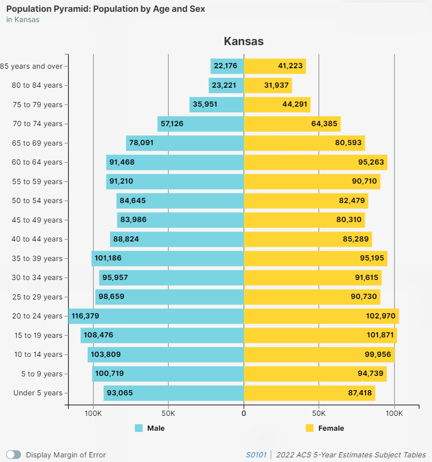

---
output:
  html_document:
    code_download: true
    theme: cerulean
    toc: yes
    toc_depth:  3
    toc_float:
      collapsed:  yes
      smooth_scroll: yes
    number_sections: yes
    code_folding:  show
    
params:
   ELECTION_DATE:      "2024-08-06"
   FILE_DATE:          "2024-06-24"  
   UPDATED_DATA_FILE:  "../1-First-Look/Statewide-Updated.txt"   
   SUBSET:             "County"         # "County"    | "statewide"
   GEONAME:            "Bourbon"        # "Johnson"   | "Kansas"
   VOTERS:             NULL
    
title : "`r params$GEONAME` `r params$SUBSET` Voter File - Age/Gender/Party Plots - `r params$FILE_DATE`"
author: "Earl F Glynn<br><small>watchdoglab.substack.com/</small>"
date  : "<small>`r Sys.Date()`</small>"
---

```{r setup, echo = FALSE}
# http://biostat.mc.vanderbilt.edu/wiki/Main/KnitrHtmlTemplate
require(Hmisc)    # provides knitrSet and other functions
knitrSet(lang = 'markdown',   # If using blogdown: knitrSet(lang='blogdown')
         fig.align = 'left',
         w = 6.5,
         h = 4.5,
         cache = FALSE)
```

`r hidingTOC(buttonLabel = "Outline")`

```{r startYourEngines, include=FALSE}
knitr::opts_chunk$set(
  echo = TRUE,
  comment = NA)

time.1 <- Sys.time()
```

# Backstage {.tabset .tabset-fade .tabset-pills}

## {.active}

## Constants

```{r}
girlPink <-  "#FFC0CB"
boyBlue  <-  "#89CFF0"  
```

```{r}
EXCEL_LIMIT <- 2^20
```

```{r}
plotCaptionLeftSoS    <- paste("Kansas Secretary of State, Voter File,", params$FILE_DATE)
plotCaptionLeftCensus <- "US Census 2022 ACS 5-Year Estimates, S0101 Subject Tables"
plotCaptionRight      <- paste("efg", format(Sys.time(), "%Y-%m-%d"))
```

```{r}
graphicsLabel <- paste(params$GEONAME, params$SUBSET)

if (params$SUBSET !=  "statewide")
{
  graphicsLabel <- paste0(graphicsLabel, ", KS")
}                                             
```


## Packages

```{r Packages}
library(tidyverse)
library(ggplot2)
```

Display formatting

```{r Display}
library(kableExtra)  
```

I/O

```{r IO}
library(readxl)      # read_xlsx
library(readr)       # write_csv
library(writexl)     # write_xlsx
```

Graphics

```{r Graphics}
library(scales)      # comma, comma_format
```

## ggplot theme

[ggplot Themes Gallery](https://www.datanovia.com/en/blog/ggplot-themes-gallery/)

```{r ggplotTheme}
theme_set(theme_minimal() +

          theme(
                axis.text             = element_text(size = 12),
                axis.title            = element_text(size = 14),
                
                axis.text.x           =  element_text(size = 11),
                axis.text.y           =  element_text(size = 12),

                plot.caption          = element_text(hjust = c(0.0,1.0),
                                                     size = 10),
                plot.caption.position = "plot",

                plot.title            = element_text(color = "steelblue1",  size = 16, face = "bold"),
                plot.subtitle         = element_text(color = "black", size = 14),
                plot.title.position   = "plot",

                strip.background      = element_rect(fill = "aliceblue"),
                strip.text            = element_text(size = 14)
               )
         )

```

## Helper functions

```{r}
plural <- function(n, singularForm, pluralForm)
{
  if  (n == 1)
  {
    noun <- singularForm  
  } else {
    if (pluralForm == "")
    {
       noun <- paste0(singularForm, "s")
    } else
    {
      noun <- pluralForm
    }
  }
  return (noun)
}
```

```{r PlotVoterCountsByAgeIntervals}
PlotVoterCountsByAgeIntervals <- function(ageGenderDataInterval,
                                          ageGenderDataIntervalWide,
                                          TITLE, LABEL)
{

  ageGenderDataIntervalFiltered <-
    ageGenderDataInterval       |>
    filter(Gender %in% c("F", "M"))  # Exclude unknown in plot since so small

  ageGenderPlotIntervalWide <-
    ggplot()  +
    geom_bar(data = ageGenderDataIntervalFiltered,
             aes(x = AgeInterval, y = Counts, fill = Gender),
             stat = "identity",
             position = "dodge")                                +    # stack
    scale_y_continuous("Voters", labels = scales::comma)        +
    theme(
           axis.text          = element_text(size = 10),
           axis.ticks.x       = element_line(),
           panel.grid.major.x = element_blank(),
           legend.position = "none"
         )                                                      +
    geom_text(aes(x = ageGenderDataIntervalWide$AgeInterval,
                  y = 0),
                  label = comma(ageGenderDataIntervalWide$F),
              hjust = 0.0, vjust = -0.5, size=4, angle = 90)    +
    geom_text(aes(x = ageGenderDataIntervalWide$AgeInterval,
                  y = 0),
                  label = comma(ageGenderDataIntervalWide$M),
              hjust = 0.0, vjust = 1.5, size=4, angle = 90)     +
    scale_fill_manual(values = c(girlPink, boyBlue))         +
    labs(title = paste(TITLE, "-", LABEL),
         subtitle = paste(comma(sum(ageGenderDataIntervalWide$F)), "Female (pink), ",
                          comma(sum(ageGenderDataIntervalWide$M)), "Male (blue), ",
                          comma(sum(ageGenderDataIntervalWide$U)), "Unknown (not shown)"),
         x = "Age[years]",
         y = "Number of Voters",
         caption = c(paste0("Source: ", plotCaptionLeftSoS), 
                     plotCaptionRight))

  ageGenderPlotIntervalWide
}
```

```{r PlotVoterCountsByAgeInYears}
PlotVoterCountsByAgeInYears <- function(ageData, nExclude, TITLE, LABEL)
{
  agePlot <-
    ggplot(data = ageData, aes(x = Age, y = Counts))                      +
    geom_bar(stat = "identity", fill = "steelblue1", colour = "grey80")   +
    scale_y_continuous(labels = scales::comma)                            +
    scale_x_continuous(breaks = min(ageData$Age, na.rm = TRUE):
                                max(ageData$Age, na.rm = TRUE),
                                minor_breaks=NULL)                        +
    coord_cartesian(xlim = c(min(ageData$Age, na.rm = TRUE) - 1,
                             max(ageData$Age, na.rm = TRUE) + 1), expand = FALSE)  +
    labs(title = paste(TITLE, "-", LABEL),
         subtitle = paste(comma(nrow(voters)), 
                          "voters", 
                          " [but excluding ",
                          nExclude,  plural(nExclude, "voter", ""),  "> 105 years]"),
         x = "Age[years]",
         y = "Number of Voters",     
         caption = c(paste("Source: ", plotCaptionLeftSoS), 
                     plotCaptionRight))                                   +
    theme(axis.text.x        = element_text(size =  7.5),
          axis.text.y        = element_text(size = 12),
          axis.ticks.x       = element_line(),
          panel.grid.major.x = element_blank())                           +
    geom_text(data = ageData,
              aes(x = Age, y = 0,
                  label = format(Counts, big.mark=",")),
                  vjust = 0.5, hjust = 0, size = 3, angle = 90)

  agePlot
}
```

```{r Helpers}
Show <- function(data, caption="", bigMark="",
                 height = NULL, width = NULL, ...)
{
  data                                       |>
  kable("html", caption=caption,
        format.args=list(big.mark=bigMark))  |>
  kable_styling(bootstrap_options=c("striped", "bordered", "condensed"),
                position="left",
                full_width=FALSE, ...)       |>
  scroll_box(height = height, width = width) 
}
```

```{r statSummary}
statSummary <- function(d, variables)
{
  results <- NULL

  for (v in variables)
  {
    values <- pull(d, v)
    results <- bind_rows(results,
                         tibble(
                                Variable = v,
                                N        = length(values),
                                NMiss    = sum(is.na(min(values))),
                                Mean     = mean(values, na.rm = TRUE),
                                StdDev   = sd(values,   na.rm = TRUE),
                                Min      = min(values,  na.rm = TRUE),
                                Q01      = quantile(values, 0.01, na.rm = TRUE),
                                Q05      = quantile(values, 0.05, na.rm = TRUE),
                                Q10      = quantile(values, 0.10, na.rm = TRUE),
                                Q25      = quantile(values, 0.25, na.rm = TRUE),
                                Median   = median(values,         na.rm = TRUE),
                                Q75      = quantile(values, 0.75, na.rm = TRUE),
                                Q90      = quantile(values, 0.90, na.rm = TRUE),
                                Q95      = quantile(values, 0.95, na.rm = TRUE),
                                Q99      = quantile(values, 0.99, na.rm = TRUE),
                                Max      = max(values,            na.rm = TRUE)
                               )
                        )
  }

  results
}
```

# Voter Data

`AgeInterval` is consistent with US Census 5-year intervals (except for 18-19 interval)

Read once in driver to save time.  Otherwiswe,load data if only template.

```{r Read-Voter-File, warning = FALSE}
if (is.null(params$VOTERS))
{
  voters <- 
  read_tsv(params$UPDATED_DATA_FILE, 
           show_col_types = FALSE,
           guess_max = EXCEL_LIMIT)        |>
  rename(Gender      = cde_gender)         |> 
  mutate(AgeInterval = factor(AgeInterval,
                              levels = c(
                                          "18-19", "20-24",  "25-29",   "30-34", "35-39",  
                                          "40-44", "45-49",  "50-54",   "55-59", "60-64",   
                                          "65-69", "70-74",  "75-79",   "80-84", "85+"
                                        )
                                
                                
                             )
        )
} else {
  voters <- params$VOTERS
}

nrow(voters)
```

## Filter

```{r}
if (params$SUBSET == "County")
{
  voters <- 
    voters |>
    filter(County == params$GEONAME)
  
  nrow(voters)
}
```


## Status

```{r}
statusStats <- table(voters$cde_registrant_status,useNA = "ifany")
statusStats
```


## Gender

```{r stateVoteStats}
genderStats <- table(voters$Gender, useNA = "ifany")
genderStats
```

```{r}
if (! "U" %in% names(genderStats))
{
  genderStats <- c(genderStats, U = 0)
  genderStats
}
```

## Age Interval

```{r}
intervalStats <- table(voters$AgeInterval, useNA = "ifany")
intervalStats 
```

## Party

```{r}
partyStats <- table(voters$desc_party, useNA = "ifany")
partyStats
```


## Stats

```{r}
statSummary(voters, "Age")  |>  Show(bigMark = ",")
```

## Too Old

Limit single-year bar plots to 105 years

```{r}
AGE_LIMIT <- 105    
```

```{r}
tooOld <-
  voters |>
  filter(Age > AGE_LIMIT | is.na(Age))

nrow(tooOld)
```

```{r}
if (nrow(tooOld) > 0)
{
  table(tooOld$BirthYear)
  write_xlsx(tooOld, paste0(params$GEONAME, "-", "Voters-Too-Old.xlsx"))
}
```

# Census Data

Totals by age interval

```{r}
censusTotal <- 
  read_xlsx("Data-Census-Gov/Census-Kansas-Total-Wide-S0101-ACS-5yr-2022.xlsx") |>
  filter(GEONAME == params$GEONAME)
dim(censusTotal)
```

Separate gender total by age interval

```{r}
CensusMale <- 
  read_xlsx("Data-Census-Gov/Census-Kansas-Male-Wide-S0101-ACS-5yr-2022.xlsx") |>
  filter(GEONAME == params$GEONAME)
dim(CensusMale)
```

```{r}
CensusFemale <- 
  read_xlsx("Data-Census-Gov/Census-Kansas-Female-Wide-S0101-ACS-5yr-2022.xlsx") |>
  filter(GEONAME == params$GEONAME)
dim(CensusFemale)
```

## Marks and labels for plots 

`CensusMale` and `CensusFemale` mark values 

### Age Intervals

```{r}
IntervalRange <- 8:22                          # hard code for now
names(CensusMale)[IntervalRange]
```

Total by Interval

```{r}
CensusTotalMark  <- tibble(CensusTotal = as.numeric(censusTotal[1,  IntervalRange]),   
                           x           = 1:length(CensusTotal))

CensusMarkLabelTotal <- tibble(y = max(CensusTotalMark$CensusTotal),   # heuristic 
                               x = 0.5 + which(CensusTotalMark$CensusTotal == y)[1]  )
```

Male / Female by Interval

```{r}
CensusMaleMark   <- tibble(CensusMale = as.numeric(CensusMale[1,  IntervalRange]),         
                           x       = 1:length(CensusMale))

CensusFemaleMark <- tibble(CensusFemale = as.numeric(CensusFemale[1,  IntervalRange]),     
                           x       = 1:length(CensusFemale))

CensusMarkLabelMaleFemale <- tibble(y = max(CensusMaleMark$CensusMale),   # since male is right bar
                                    x =  0.5 + which(CensusMaleMark == y)[1])   # heuristic
```

The 2022 ACS 5-year estimate from the US Census says the `r {graphicsLabel}` population is `r {comma(censusTotal$Total)}` with `r {comma(censusTotal$Age_18_and_over)}` of voting age (18 or over) [`r {round(100 *censusTotal$Age_18_and_over / censusTotal$Total, 2)}`%].

There were `r {comma(nrow(voters))}` voters in `r {graphicsLabel}`  on `r {params$FILE_DATE}`, which is `r {round(100 * nrow(voters) / censusTotal$Age_18_and_over, 2)}`% of the voting age population. 

Inactive voters not removed from voter rolls in a timely manner will inflate the registration rate of the voting age population, sometimes above 100%.  But this may be an indication that voter rolls are not being maintained properly.

Let's explore the voter registration rated of `r {graphicsLabel}` voters by age and gender with comparisons to census populations.


The voting age population of `r {comma(censusTotal$Age_18_and_over)}` can be broken down by gender and further broken down by number of registered voters:

* Female: `r {comma(CensusFemale$Age_18_and_over)}` voting age with `r {comma(genderStats["F"])}` voters [`r {round(100 * genderStats["F"] / CensusFemale$Age_18_and_over,2)}`%].

* Male:  `r {comma(CensusMale$Age_18_and_over)}` voting age with `r {comma(genderStats["M"])}` voters [`r {round(100 * genderStats["M"] / CensusFemale$Age_18_and_over,2)}`%].

* Unknown:  `r {comma(genderStats["U"])}` voters.  These cannot be matched with census data, which actually slightly lowers the precentages above for Female and Male.

# Age By Year

```{r}
votersByAge <-
  voters                    |>
  filter(Age <= AGE_LIMIT &
         !is.na(Age))       |>
  group_by(Age)             |>
  summarize(Counts = n()) 

nrow(votersByAge)
```

```{r Plot-Voters-by-Age, fig.width = 16, fig.height = 6}
TITLE <- "Registerd Voters by Age"
votersAgePlot <- PlotVoterCountsByAgeInYears(votersByAge, 
                                             nrow(tooOld),
                                             TITLE,
                                             graphicsLabel)
print(votersAgePlot)
```

```{r Voters-by-Age-SVG, fig.width = 16, fig.height = 6}
svg( paste0(params$GEONAME,"-Registered-Voters-by-Year-of-Age.svg"), width = 16, height = 6, pointsize = 10)
print(votersAgePlot)
dev.off()
```
```{r}
write_xlsx(votersByAge, paste0(params$GEONAME, "-Registered-Voters-by-Year-of-Age.xlsx"))
```

# Age by 5-Year Interval

Total, Inactive, Active

```{r}
ageInterval <-
  voters                    |>
  filter(!is.na(Age))       |>
  group_by(AgeInterval)     |>
  summarize(
            Voters   = n(),
            Active   = sum(cde_registrant_status == "A"),
            Inactive = sum(cde_registrant_status == "I")
           )

ageInterval <- 
  bind_cols(ageInterval, Census = CensusTotalMark$CensusTotal) 

ageInterval <- 
  bind_rows(ageInterval, 
            
            data.frame(as.list(colSums(ageInterval[,-1]) )) |>
            mutate(AgeInterval = "Total")      
            )                                               |>
  mutate(
         `% Inactive`   = round(100 * Inactive / Voters, 2),
         `% Registered` = round(100 * Voters   / Census, 2)  
        )                                                   |>
 select(AgeInterval, Census, Voters, `% Registered`, Active, Inactive, `% Inactive`)

ageInterval |>  Show(bigMark = ",")
```

```{r}
write_xlsx(ageInterval, paste0(params$GEONAME, "-", "Graphic-Age-Census-Active-Inactive-Voter.xlsx"))
```

```{r}
totalLine <- 
  ageInterval |>
  filter(AgeInterval == "Total")
```


```{r}
plotData <- 
  ageInterval |> filter(row_number() <= n() - 1) |>  # Remove last row
  select(AgeInterval, Active, Inactive)                                       |>
  pivot_longer(!AgeInterval, names_to = "Status", values_to = "Voters")       |>
  mutate(Status = factor(Status, levels = c("Inactive", "Active"))) 
```

```{r}
CensusRegistration  <- 
  tibble(
          x       = 1:length(IntervalRange),
          y       = ageInterval$Voters[-nrow(ageInterval)],
          Percent = paste0(ageInterval$`% Registered`[-nrow(ageInterval)], "%")
        )
```

```{r Plot-PercentRegisteredAgeInterval, fig.width = 10, fig.height = 5.5}
TITLE <- "Percent Registered of Voting Age"

ageIntervalPlot <-
  ggplot()  +
  geom_bar(data = plotData,
           aes(x    = AgeInterval, 
               y    = Voters,
               fill = Status, 
               group = Status),
            show.legend = TRUE,
            stat = "identity" )                               +   
  scale_y_continuous("Voters", labels = scales::comma)        +
  scale_fill_manual(values = c("grey", "steelblue1"))            +
  theme(
         axis.text          = element_text(size = 10),
         axis.ticks.x       = element_line(),
         panel.grid.major.x = element_blank(),
         legend.position = "bottom"
       )                                                      +
  labs(title = paste0(TITLE, " - ", graphicsLabel, ": ", totalLine$`% Registered`, "%"),
       subtitle = paste0(comma(as.numeric(totalLine["Census"])), " Census Voting Age; ",
                         comma(nrow(voters)), " Voters:  ",    
                         comma(statusStats["A"]), " Active, ",
                         comma(statusStats["I"]), " Inactive",
                         " [", totalLine$`% Inactive`, "%", "]"),
       x = "Age[years]",
       y = "Number of Voters",
       caption = c(paste0("Sources: ", plotCaptionLeftSoS, "\n", 
                          plotCaptionLeftCensus),
                   plotCaptionRight))     +
  
  geom_segment(data = CensusTotalMark,
               aes(x = x - 0.45, 
                   y = CensusTotal,
                   xend = x + 0.45,
                   yend = CensusTotal),
                   color = "black",
                   size = 1.5
                  )                                           +
  geom_text(data = CensusMarkLabelTotal,                       
            aes(x = x, y = y),
            label = "U.S. Census Population Estimates",
            color = "black",
            fontface = "bold",
            size = 5,
            adj = 0)                                          +        

  geom_text(data = CensusRegistration,
            aes(x = x, 
                y = y),
                label = CensusRegistration$Percent,
                color = "black",
                fontface = "bold",
                hjust = 0.5, vjust =  0, size = 3 , angle = 0)    
  
print(ageIntervalPlot)
```

```{r PlotPercentRegisteredAgeInterval-SVG, fig.width = 16, fig.height = 6}
svg( paste0(params$GEONAME, "-Registered-Voters-by-Age.svg"), width = 16, height = 6, pointsize = 10)
print(votersAgePlot)
dev.off()
```

# Age by Census 5-Year Interval and Gender

```{r}
ageGenderDataInterval <-
  voters                         |>
  filter(!is.na(Age))            |>
  group_by(AgeInterval, Gender)  |>
  summarize(Counts = n(),
            .groups = "drop")        
 
ageGenderDataIntervalWide <-
  ageGenderDataInterval  |>
  spread(Gender, Counts, fill = 0)

if (!("U" %in% names(ageGenderDataIntervalWide)))
{
  ageGenderDataIntervalWide$U <- 0
}

ageGenderDataIntervalWide  |>  Show(bigMark = ",")
```

```{r Plot-Voters-by-Age-Gender, fig.width = 10, fig.height = 5}
TITLE = "Registered Voters by Age Interval and Gender"

registeredVotersByGenderPlot <-
  PlotVoterCountsByAgeIntervals(ageGenderDataInterval,
                                ageGenderDataIntervalWide,
                                TITLE,
                                graphicsLabel)
print(registeredVotersByGenderPlot)
```

```{r Plot-Voters-by-Age-Gender-SVG, fig.width = 10, fig.height = 5}
svg( paste0(params$GEONAME, "-Registered-Voters-by-Age-and-Gender.svg"), width = 10, height = 5, pointsize = 10)
print(registeredVotersByGenderPlot)
dev.off()
```

## Comparison to Census intervals

```{r}
registeredVotersByGenderPlotwithCensus <- 
  registeredVotersByGenderPlot                  + 
    
     geom_segment(data = CensusMaleMark,
                 aes(x = x, 
                     y = CensusMale,
                     xend = x + 0.4,
                     yend = CensusMale),
                     color = "black",
                     size = 1.5
                    )                           +
    geom_segment(data = CensusFemaleMark,
                 aes(x = x - 0.45, 
                     y = CensusFemale,
                     xend = x - 0.05,
                     yend = CensusFemale),
                     color = "black",
                     size = 1.5
                    )                           +
    geom_text(data = CensusMarkLabelMaleFemale, 
              aes(x = x, y = y),
              label = "U.S. Census Population Estimates",
              color = "black",
              fontface = "bold",
              size = 5,
              adj = 0)                          +
  labs(caption = c(paste0("Sources: ", plotCaptionLeftSoS, "\n", 
                            plotCaptionLeftCensus),
                     plotCaptionRight)) 
```

```{r Plot-Voters-by-Age-Gender-Census, fig.width = 10, fig.height = 5}
print(registeredVotersByGenderPlotwithCensus) 
```

```{r Plot-Voters-by-Age-Gender-Census-SVG, fig.width = 10, fig.height = 5}
svg( paste0(params$GEONAME, "-Registered-Voters-by-Age-and-Gender-", params$SUBSET, ".svg"), width = 10, height = 5, pointsize = 10)
print(registeredVotersByGenderPlotwithCensus) 
dev.off()
```
## Unknown Gender Voters

```{r Plot-Voters-by-Age-Gender-Unknown, fig.width = 10, fig.height = 5}
if (sum(ageGenderDataIntervalWide$U) > 0)
{
  TITLE <- "Registered Voters by Age Interval and Gender"
  
  ageGenderDataIntervalFiltered <-
    ageGenderDataInterval       |>
    filter(Gender == "U") 
  
    ageGenderPlotIntervalWide <-
      ggplot()  +
      geom_bar(data = ageGenderDataIntervalFiltered,
               aes(x = AgeInterval, y = Counts, fill = Gender),
               stat = "identity" )                               +   
      scale_y_continuous("Voters", labels = scales::comma)        +
      theme(
             axis.text          = element_text(size = 10),
             axis.ticks.x       = element_line(),
             panel.grid.major.x = element_blank(),
             legend.position = "none"
           )                                                      +
      geom_text(aes(x = ageGenderDataIntervalWide$AgeInterval,
                    y = 0),
                    label = comma(ageGenderDataIntervalWide$U),
                hjust = 0.0, vjust = 0.5, size=5, angle = 90)    +
      scale_fill_manual(values = c("grey"))         +
      labs(title = paste(TITLE, "-", graphicsLabel),
           subtitle = paste(comma(sum(ageGenderDataIntervalWide$U)), "Unknown Gender"),  
           x = "Age[years]",
           y = "Number of Voters",
           caption = c(paste("Source: ", plotCaptionLeftSoS), plotCaptionRight))
  
  ageGenderPlotIntervalWide
  
}
```

```{r}
colTotals <- colSums(ageGenderDataIntervalWide[,-1])
colTotals
```

```{r}
if (! "U" %in% names(colTotals))
{
  colTotals <- c(colTotals, U = 0)
}
```

```{r}
colVoteSummary <- tibble(AgeInterval = "Total",
                         VoteF = colTotals["F"],
                         VoteM = colTotals["M"],
                         VoteU = colTotals["U"])
colVoteSummary |> Show()
```

```{r}
graphicAgeGenderData <- 
   bind_cols(ageGenderDataIntervalWide,
             CensusFemale = CensusFemaleMark$CensusFemale,
             CensusMale   = CensusMaleMark$CensusMale)    

if (! "U" %in% names(graphicAgeGenderData))
{
  graphicAgeGenderData$U <- 0
}

graphicAgeGenderData  <-
  bind_rows(graphicAgeGenderData,

            data.frame(as.list(colSums(graphicAgeGenderData[,-1]) )) |> 
            mutate(AgeInterval = "Total") 
         )                                                           |>
  mutate(`% Female` = round(100 * F / CensusFemale, 2),
         `% Male`   = round(100 * M / CensusMale, 2),
          AgeInterval = as.character(AgeInterval))   |>
  select(AgeInterval, VoterFemale  = F, CensusFemale, `% Female`,
                      VoterMale    = M, CensusMale,   `% Male`,
                      VoterUnknown = U)

graphicAgeGenderData |> Show(bigMark = ",")
```

```{r}
write_xlsx(graphicAgeGenderData, paste0(params$GEONAME, "-Graphic-Age-Gender-Census-Voter.xlsx"))
```

# US Census Population Pyramid for Kansas

Compare to [US Census "Population Pyramid" for Kansas](https://data.census.gov/profile/Kansas?g=040XX00US20#populations-and-people):

```{r, out.width = "900px", echo = FALSE}
if (params$SUBSET == "statewide")
{
  
}
```

See [American Community Survey 5-Year Data (2009-2022)](https://www.census.gov/data/developers/data-sets/acs-5year.html).

# Age of Voters by 5-Year Age Interval and Gender by Party

Scale separately by party

```{r}
table(voters$desc_party, useNA = "ifany")
```

```{r AgeByIntervalByParty, fig.width = 10, fig.height = 5}
plotParty <- function(PARTY, TITLE, LABEL)
{
  ageGenderDataIntervalParty <-
    voters                         |>
    filter(!is.na(Age),
           desc_party == PARTY)    |>
    group_by(AgeInterval, Gender)  |>
    summarize(Counts = n(),
              .groups = "drop")
  
  # KLUDGE fix so zero bars not plotted with wrong color and height
  fullGrid <- 
    expand.grid(AgeInterval = droplevels(ageGenderDataIntervalParty$AgeInterval),
                Gender      = unique(ageGenderDataIntervalParty$Gender),
                stringsAsFactors = FALSE) |> 
     unique() |> 
     arrange(AgeInterval, Gender) 
  
  ageGenderDataIntervalParty <- 
    fullGrid |>
    left_join(ageGenderDataIntervalParty, 
              by = join_by(AgeInterval, Gender))

fullGrid |>
  left_join(ageGenderDataIntervalParty, 
            by = join_by(AgeInterval, Gender)) 
  
  # KLUDGE to fix problem with zeros
  
  ageGenderDataIntervalWideParty <-
    ageGenderDataIntervalParty     |>
    spread(Gender, Counts, fill = 0)
  
  ageGenderDataIntervalWideParty  |>  Show(bigMark = ",")
  
  #print( colSums(ageGenderDataIntervalWideParty[,-1]))  # Don't do this or ggplot may not appear when knitted
  
  registeredVotersByGenderPartyPlot <-
    PlotVoterCountsByAgeIntervals(ageGenderDataIntervalParty,
                                  ageGenderDataIntervalWideParty,
                                  TITLE, paste(LABEL, "-", PARTY))
  
  registeredVotersByGenderPartyPlot 
}
```

```{r Plot-Voters-by-Age-Gender-Party-Democratic, fig.width = 10, fig.height = 5}
TITLE <- "Registered Voters by Age Interval and Gender"
PARTY <- "Democratic"

partyPlot <- plotParty(PARTY, TITLE, graphicsLabel)

print(partyPlot)
  
svg( paste0(params$GEONAME, "-Registered-Voters-by-Age-and-Gender-", 
            params$SUBSET, "-", PARTY, ".svg"), width = 10, height = 5, pointsize = 10)
print(partyPlot)
dev.off()
```

```{r Plot-Voters-by-Age-Gender-Party-Republican, fig.width = 10, fig.height = 5}
PARTY <- "Republican"
partyPlot <- plotParty(PARTY, TITLE, PARTY)

print(partyPlot)
  
svg( paste0(params$GEONAME, "-Registered-Voters-by-Age-and-Gender-", 
            params$SUBSET, "-", PARTY, ".svg"), width = 10, height = 5, pointsize = 10)
print(partyPlot)
dev.off()
```

```{r Plot-Voters-by-Age-Gender-Party-Unaffiliated, fig.width = 10, fig.height = 5}
PARTY <- "Unaffiliated"
partyPlot <- plotParty(PARTY, TITLE, graphicsLabel)

print(partyPlot)
  
svg( paste0(params$GEONAME, "-Registered-Voters-by-Age-and-Gender-", 
            params$SUBSET, "-", PARTY, ".svg"), width = 10, height = 5, pointsize = 10)
print(partyPlot)
dev.off()
```

**UNCLEAR** why `ggplots` won't appear here inline inside an `if` statement when processed as a parameterized file from the driver.

But the SVG versions of the graphics are still created.

```{r Plot-Voters-by-Age-Gender-Party-Libertarian, fig.width = 10, fig.height = 5}
if (partyStats["Libertarian"] > 10)
{
  PARTY <- "Libertarian"
  partyPlot <- plotParty(PARTY, TITLE, graphicsLabel)
  
  print(partyPlot)
    
  svg( paste0(params$GEONAME, "-Registered-Voters-by-Age-and-Gender-", 
              params$SUBSET, "-", PARTY, ".svg"), width = 10, height = 5, pointsize = 10)
  print(partyPlot)
  dev.off()
}
```

```{r Plot-Voters-by-Age-Gender-Party-NoLabels, fig.width = 10, fig.height = 5}
if (!is.na(partyStats["No Labels Kansas"])  & partyStats["No Labels Kansas"] > 10)
{
  PARTY <- "No Labels Kansas"
  partyPlot <- plotParty(PARTY, TITLE, graphicsLabel)
  
  print(partyPlot)
    
  svg( paste0("Kansas-Registered-Voters-by-Age-and-Gender-", 
              params$SUBSET, "-", str_replace_all(PARTY, " ", "-"), ".svg"), width = 10, height = 5, pointsize = 10)
  print(partyPlot)
  dev.off()
} else {
  partyStats["No Labels Kansas"]
}
```

```{r Plot-Voters-by-Age-Gender-Party-UnitedKansas, fig.width = 10, fig.height = 5}
if (!is.na(partyStats["United Kansas"])  & partyStats["United Kansas"] > 10)
{
  PARTY <- "United Kansas"
  partyPlot <- plotParty(PARTY, TITLE, graphicsLabel)
  
  print(partyPlot)
    
  svg( paste0("Kansas-Registered-Voters-by-Age-and-Gender-", 
              params$SUBSET, "-", str_replace_all(PARTY, " ", "-"), ".svg"), width = 10, height = 5, pointsize = 10)
  print(partyPlot)
  dev.off()
} else {
  partyStats["United Kansas"] 
}
```

# Epilog {.tabset .tabset-fade .tabset-pills}

##  {.active}

## Session Info

```{r devtoolsSessionInfo}
devtools::session_info()
```

</div>

```{r epilogDeltaTime, echo=FALSE}
time.2 <- Sys.time()
processingTime <- paste("Processing time:", sprintf("%.1f",
                        as.numeric(difftime(time.2,
                                            time.1, units="secs"))), "secs\n")
```

`r processingTime` `r format(time.2, "%Y-%m-%d %H%M")`
