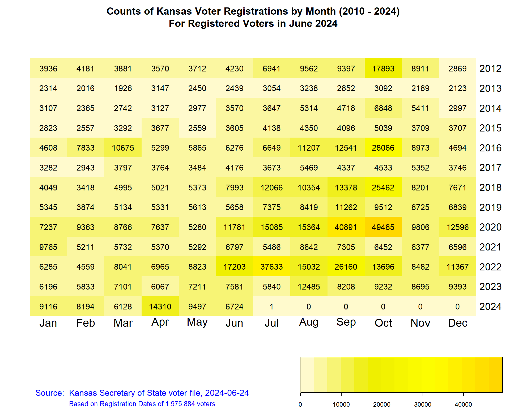
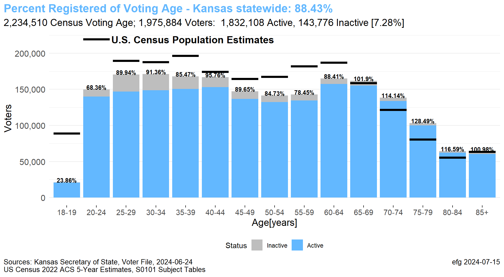
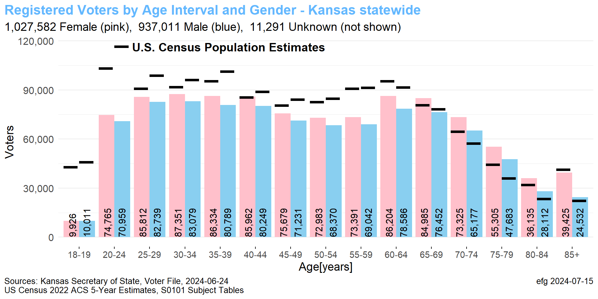
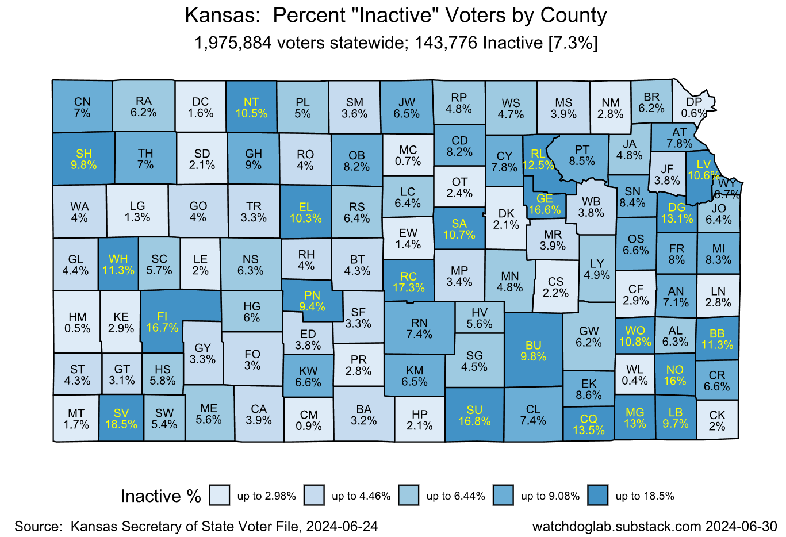

# Technical Analysis of Kansas Voter Rolls

Under development.  These comments by folder will be expanded.

# First Look

Kansas-First-Look.html

Statewide-Field-Length-Summary-2024-06-24.xlsx

Counts-by-County-2024-06-24.xlsx

Counts-by-Precinct-2024-06-24.xlsx

Crosstab-BirthYear-by-BirthMonth-2024-06-24.xlsx

Counts folder

# Age-Gender-Party

Age-Gender-Party-Driver.html

Age-Gender-Party-Template.Rmd

Age-Gender-Party-Template-Kansas-statewide.html

[See related article](https://watchdoglab.substack.com/p/demographics-of-kansas-voters-part)

# Active-Inactive

[See related article](https://watchdoglab.substack.com/p/kansas-still-has-over-140000-inactive)

